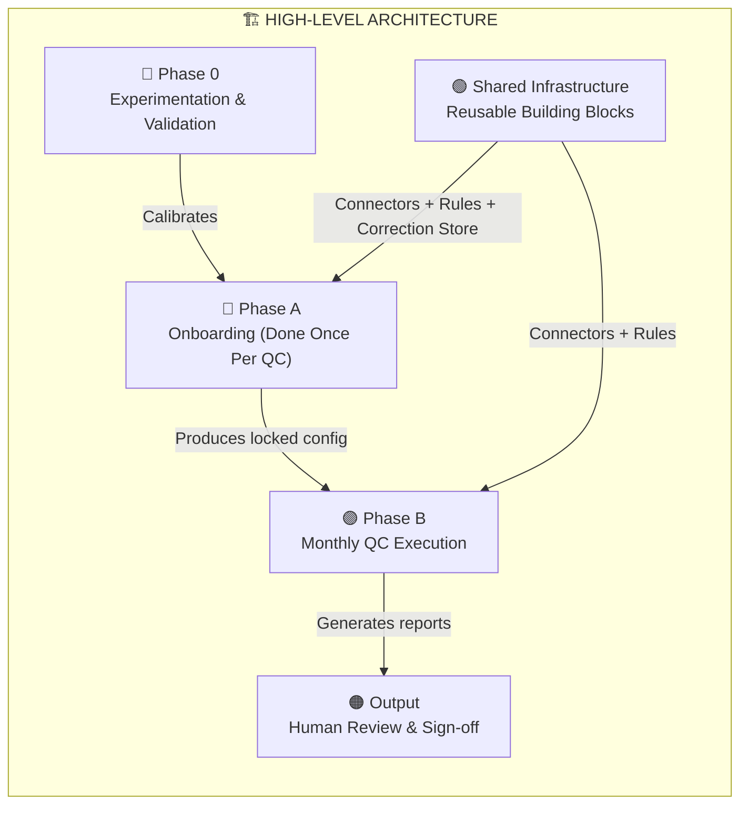
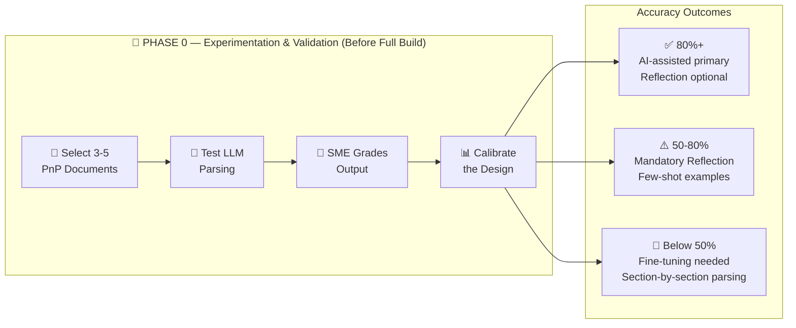
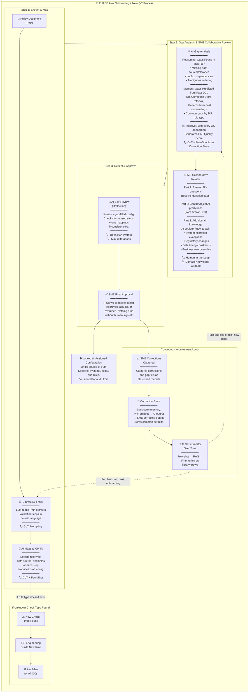
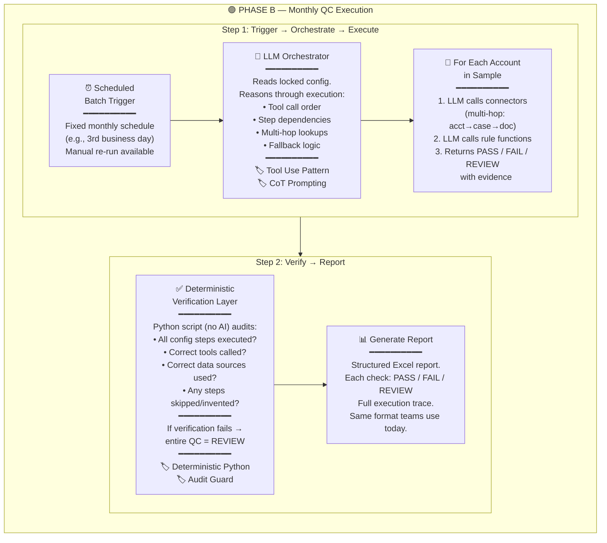
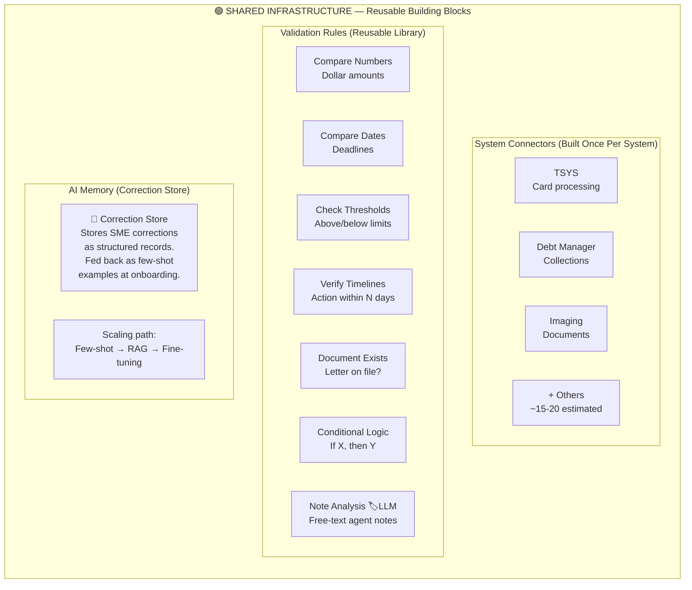
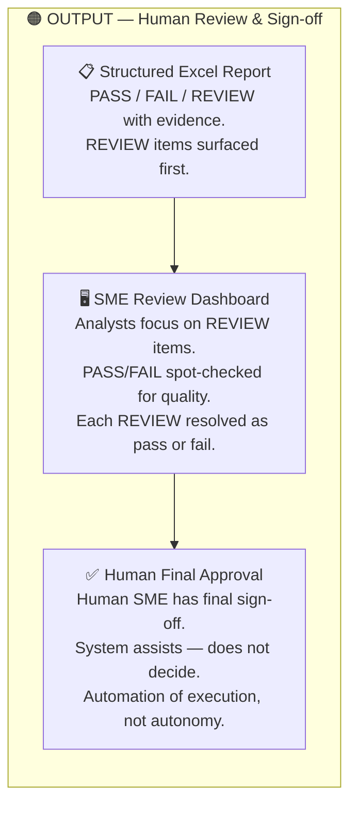
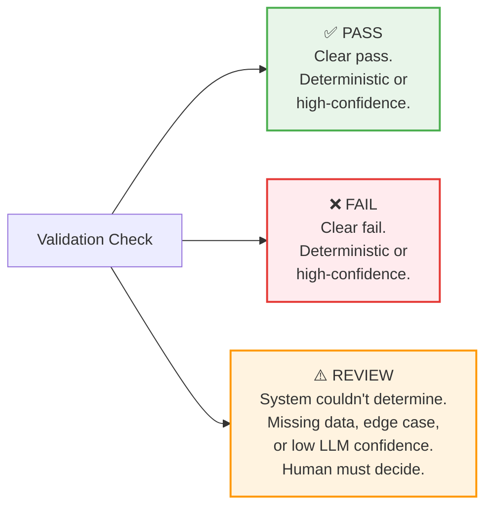
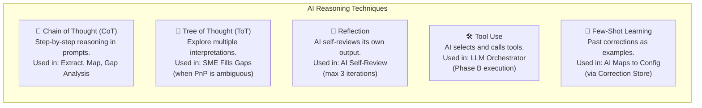
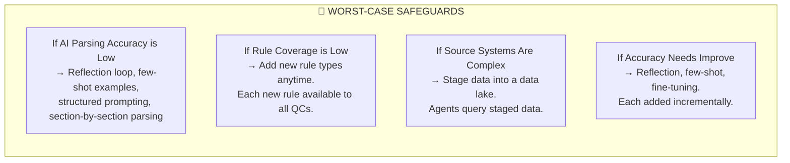

# Agentic QC Automation — Architecture Flowchart

> End-to-End Architecture for Scalable Quality Control Automation — Worst-Case Design

---

## High-Level Overview

---

## Phase 0 — Experimentation & Validation

---

## Phase A — Onboarding a New QC Process (Done Once Per QC)

---

## Phase B — Monthly QC Execution

---

## Shared Infrastructure — Reusable Building Blocks

---

## Output — Human Review & Sign-off

---

## Three-Outcome Model (PASS / FAIL / REVIEW)

---

## Reasoning Techniques Used

---

## Worst-Case Safeguards

